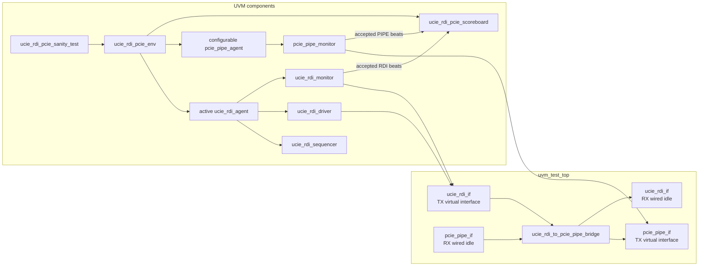
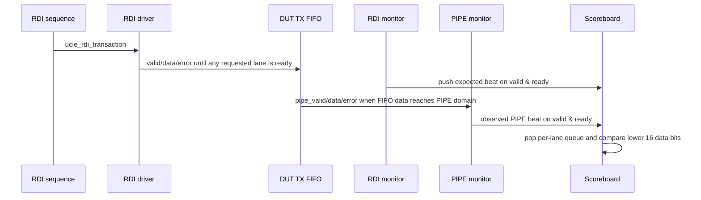

# UVM verification guide

This guide describes the UVM environment in `test/uvm/` as it exists in this repository. It is intended to help verification owners extend the environment without confusing it with the Verilator smoke testbench, which remains the current release gate.

## Current scope

| Area | Current UVM status | Notes |
|------|--------------------|-------|
| Simulator target | Synopsys VCS | Driven by `test/uvm/Makefile.vcs` with `-ntb_opts uvm-1.2`. |
| DUT parameters | Fixed 4 lanes, 16-bit RDI, 32-bit PIPE, FIFO depth 16 | The RTL is parameterized; the UVM transaction classes and scoreboard are currently fixed-width. |
| TX path (`RDI -> PIPE`) | Stimulated and scoreboarding enabled | Active RDI agent drives requests; passive PIPE monitor observes accepted beats. |
| RX path (`PIPE -> RDI`) | Wired but not stimulated or checked | `uvm_test_top` instantiates RX interfaces, ties `pipe_rx_if.valid = 0`, and keeps `rdi_rx_if.ready = 1`. |
| CRC | Disabled | `crc_enable` is tied to `4'b0`; use the non-UVM smoke test for current CRC checking. |
| Backpressure | PIPE TX ready is agent-controlled in the sanity test | The backpressure sequence now drives `ready` low then high; FIFO-full behavior is still a future extension because the RDI source driver remains handshake-gated. |
| Assertions | Compiled and active in the UVM top | CDC monitor/statistics now run in both the UVM flow and the non-UVM regression. |

## UVM block diagram



## Transaction flow



The monitor and scoreboard operate per accepted beat, not per raw cycle. Because RDI and PIPE are asynchronous, matching is queue-based by lane rather than cycle-based.

## Component map

| File | Component | Role |
|------|-----------|------|
| `test/uvm/uvm_test_top.sv` | `uvm_test_top` | Generates clocks/reset, instantiates interfaces and DUT, binds virtual interfaces with `uvm_config_db`, starts UVM. |
| `test/uvm/ucie_rdi_if.sv` | `ucie_rdi_if` | RDI TX/RX signal bundle with driver and monitor clocking blocks. |
| `test/uvm/pcie_pipe_if.sv` | `pcie_pipe_if` | PIPE TX/RX signal bundle with driver and monitor clocking blocks. |
| `test/uvm/ucie_rdi_pcie_pkg.sv` | transaction classes | Fixed-width RDI and PIPE sequence items for 4 lanes. |
| `test/uvm/ucie_rdi_pcie_pkg.sv` | `ucie_rdi_driver` | Drives RDI TX `valid`, `data`, and `error` through `ucie_rdi_if.drv_cb`. |
| `test/uvm/ucie_rdi_pcie_pkg.sv` | `ucie_rdi_monitor` | Publishes RDI TX transactions when at least one lane completes `valid & ready`. |
| `test/uvm/ucie_rdi_pcie_pkg.sv` | `pcie_pipe_monitor` | Publishes PIPE TX transactions when at least one lane completes `valid & ready`. |
| `test/uvm/ucie_rdi_pcie_pkg.sv` | `ucie_rdi_pcie_scoreboard` | Maintains one expected queue per lane and compares observed PIPE beats against RDI expectations. |
| `test/uvm/seq_lib/ucie_rdi_seq_lib.sv` | sequence library | Provides single-lane, all-lane, error, and repeated lane-1 traffic sequences. |

## Sequence and coverage intent matrix

| Sequence | Stimulus | Intended check | Current checking strength |
|----------|----------|----------------|---------------------------|
| `ucie_rdi_single_lane_seq` | One lane-0 beat with `data == 64'hDEAD` | Basic lane-0 TX transport | Lower 16 bits and zero-extended upper half on lane 0. |
| `ucie_rdi_multi_lane_seq` | One all-lane beat with lane-specific 16-bit words | Lane packing and independent per-lane queueing | Same per lane with observed PIPE handshake. |
| `ucie_rdi_error_seq` | Lane-2 valid with `error[2] == 1` | Error propagation | **Error bit compared** on observed PIPE beats (with data/zero-extension checks). |
| `ucie_rdi_flow_ctrl_seq` | Twenty lane-1 beats | Repeated traffic through FIFO | Data order checked if PIPE accepts all beats; paired with a backpressure sequence in the sanity test. |
| `pcie_pipe_backpressure_seq` | PIPE ready low then high | PIPE stall / release behavior | Drives `ready` low for 16 cycles, then restores it high for 16 cycles. |

## Scoreboard contract

| Expected behavior | Current implementation | Gap to close |
|-------------------|------------------------|--------------|
| Accepted **RDI** lane handshake creates one expected queue entry | `write_rdi()` pushes when `tr.valid[i] && tr.ready[i]` (monitor emits on full-beat handshakes) | None for TX enqueue semantics. |
| Accepted **PIPE** lane handshake consumes one expected entry | `write_pipe()` pops when `tr.valid[i] && tr.ready[i]` | None for TX dequeue semantics. |
| RDI 16-bit data zero-extends into PIPE 32-bit data | Lower **and upper** 16 PIPE bits checked vs. zero-extension | None for width check on expectations driven from RDI. |
| Error bit propagates from RDI to PIPE | `write_pipe()` compares `tr.error[i]` vs. stored expectation | None for lanes exercised by sequences. |
| End-of-test drains all TX expectation queues | `check_phase` reports `SB_DRAIN` if any `tx_exp_q[i]` non-empty | RX path / system-level closure still open. |

## Recommended UVM closure plan

| Priority | Work item | Why it matters |
|----------|-----------|----------------|
| 1 | Make transaction widths parameter-aware or centralize lane/data constants in a config object | Prevents divergence from RTL parameters and enables `NUM_LANES=1` UVM tests. |
| 2 | Extend scoreboard for RX path and full-system checks | TX path: **delivered** — per-lane `valid & ready` queueing, upper 16-bit zero check, error compare, and `check_phase` TX queue drain. |
| 3 | Expand PIPE backpressure coverage and decouple passive vs. active ready control | Required to verify FIFO full, `rdi_flow_ctrl`, and hold-under-stall behavior in UVM. |
| 4 | Add RX path sequences and a mirrored RDI RX scoreboard | The RTL includes `PIPE -> RDI`; current UVM does not exercise it. |
| 5 | Add functional coverage groups for lane, error, backpressure, FIFO occupancy, width conversion, and CRC enable | Provides measurable closure beyond pass/fail simulation. |
| 6 | Add CRC sequences with scoreboard mirror or predictor | Current CRC confidence comes from the non-UVM testbench only. |

## Run commands

From `test/uvm/`:

```bash
make -f Makefile.vcs compile
make -f Makefile.vcs run
make -f Makefile.vcs run UVM_TESTNAME=ucie_rdi_pcie_sanity_test
make -f Makefile.vcs pdf
make -f Makefile.vcs clean
```

The UVM flow requires a licensed VCS installation with UVM 1.2 support. The repository's open-source CI path uses Verilator and does not compile UVM.
