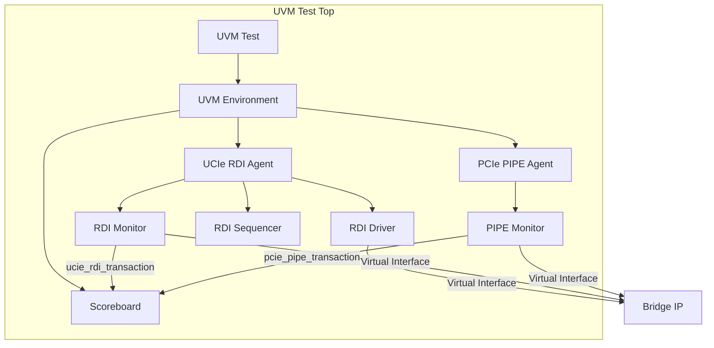

# UVM Verification Environment for UCIe RDI to PCIe PIPE Bridge

This directory contains a full Universal Verification Methodology (UVM) environment designed for the bidirectional UCIe RDI to PCIe PIPE bridge IP. It is optimized for use with Synopsys VCS and mirrors the coverage of the original SystemVerilog testbench.

## 1. Architecture Overview

The environment is structured to separate protocol-specific driving/monitoring from the high-level verification logic.



### Components

*   **RDI Agent**: Handles the UCIe 1.0 RDI protocol. It drives transactions from sequences and monitors the interface to provide transaction-level data to the scoreboard.
*   **PIPE Agent**: Monitors the PCIe Gen 4 PIPE interface. In this environment, it operates in passive mode for the transmit path (monitoring the IP output).
*   **Scoreboard**: Performs end-to-end data integrity checks. It maintains per-lane queues to account for the dual-clock domain crossing and variable latencies.

## 2. Data Flow & Scoreboarding

The bridge converts 16-bit RDI data (100MHz) to 32-bit PIPE data (150MHz).

### Transaction Lifecycle
1.  **Generation**: Sequences generate `ucie_rdi_transaction` items.
2.  **Driving**: The RDI Driver performs the valid/ready handshake on the physical wires.
3.  **Observation**: 
    *   The **RDI Monitor** captures successfully handshaked RDI beats and sends them to the Scoreboard's RDI analysis implementation.
    *   The **PIPE Monitor** captures handshaked PIPE beats from the DUT output and sends them to the Scoreboard's PIPE analysis implementation.
4.  **Matching**:
    *   The scoreboard receives an RDI transaction and pushes it into a `tx_exp_q[lane]` queue.
    *   When a PIPE transaction arrives, the scoreboard pops the corresponding RDI entry from the queue.
    *   It performs a comparison, accounting for the **zero-extension** (RDI 16-bit -> PIPE 32-bit).

## 3. Test Library

| Test Name | Description |
| :--- | :--- |
| `ucie_rdi_pcie_base_test` | Minimal test that initializes the environment. |
| `ucie_rdi_pcie_sanity_test` | Sequential run of single-lane, multi-lane, error, and flow control scenarios. |

### Available Sequences
*   `ucie_rdi_single_lane_seq`: Targets Lane 0.
*   `ucie_rdi_multi_lane_seq`: Drives all 4 lanes simultaneously.
*   `ucie_rdi_error_seq`: Verifies propagation of the `rdi_error` bit.
*   `ucie_rdi_flow_ctrl_seq`: Sends 20 consecutive beats to test FIFO backpressure.

## 4. Usage Instructions

### Running Simulation (VCS)
To compile and run the default sanity test:
```bash
make -f Makefile.vcs
```

To run a specific test:
```bash
make -f Makefile.vcs run UVM_TESTNAME=your_test_name
```

### Generating Documentation
The `Makefile.vcs` includes a target to convert this Markdown file into a PDF document.

**Requirements**: `pandoc` and a LaTeX engine (like `pdflatex` or `tectonic`).
```bash
make -f Makefile.vcs pdf
```
