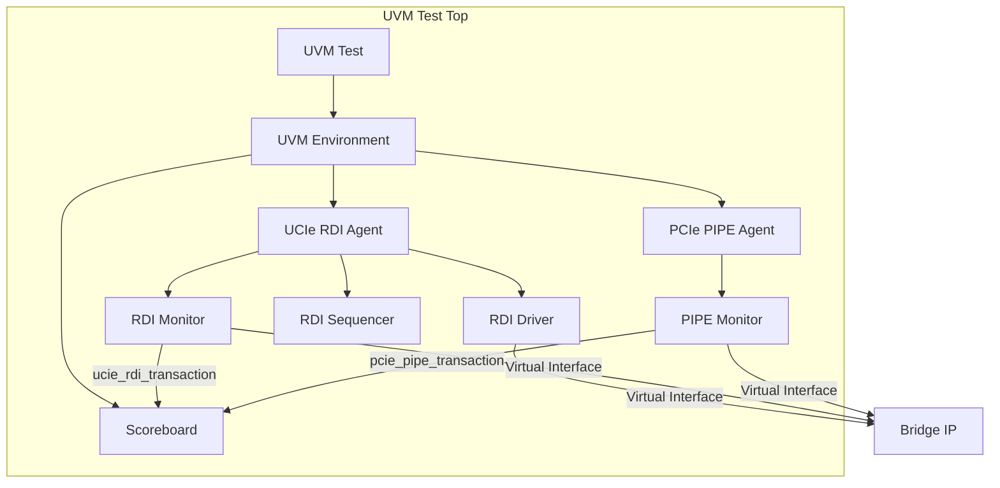
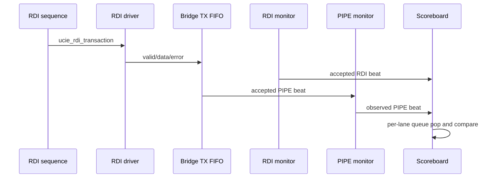

# UVM Verification Environment for UCIe RDI to PCIe PIPE Bridge

This directory contains the Universal Verification Methodology (UVM) environment for the bridge IP. It is optimized for Synopsys VCS and currently provides a TX-path UVM smoke/regression layer. The open-source release gate remains the Verilator testbench in the repository root.

For the detailed verification guide, current limitations, and closure plan, see `../../docs/uvm_verification.md`.

## 1. Architecture Overview

The environment is structured to separate protocol-specific driving/monitoring from the high-level verification logic.



### Components

| Component | Mode | Responsibility |
| :--- | :--- | :--- |
| `ucie_rdi_agent` | Active | Drives RDI TX transactions, monitors accepted RDI beats, and publishes expected items. |
| `pcie_pipe_agent` | Passive | Monitors PIPE TX accepted beats from the DUT. |
| `ucie_rdi_pcie_scoreboard` | Passive | Maintains per-lane TX expectation queues and compares observed PIPE data against RDI input data. |
| `uvm_test_top` | Static top | Generates clocks/reset, instantiates DUT/interfaces, binds virtual interfaces, and starts UVM. |

### Current Scope

| Area | Status |
| :--- | :--- |
| Simulator | VCS with UVM 1.2 (`Makefile.vcs`) |
| Parameters | Fixed in UVM at 4 lanes, 16-bit RDI, 32-bit PIPE |
| TX path | Stimulated and checked at smoke level |
| RX path | Interfaces are instantiated but RX stimulus is tied idle |
| CRC | Disabled in `uvm_test_top` |
| PIPE backpressure | `pipe_tx_if.ready` held high |
| Assertions | Not included in the UVM compile list |

## 2. Data Flow & Scoreboarding

The bridge converts 16-bit RDI data (100MHz) to 32-bit PIPE data (150MHz).

### Transaction Lifecycle
1.  **Generation**: Sequences generate `ucie_rdi_transaction` items.
2.  **Driving**: The RDI Driver performs the valid/ready handshake on the physical wires.
3.  **Observation**: 
    *   The **RDI Monitor** captures successfully handshaked RDI beats and sends them to the Scoreboard's RDI analysis implementation.
    *   The **PIPE Monitor** captures handshaked PIPE beats from the DUT output and sends them to the Scoreboard's PIPE analysis implementation.
4.  **Matching**:
    *   The scoreboard receives an RDI transaction and pushes it into a `tx_exp_q[lane]` queue.
    *   When a PIPE transaction arrives, the scoreboard pops the corresponding RDI entry from the queue.
    *   It compares the lower 16 PIPE bits with the matching RDI lane payload.



### Scoreboard Checks and Known Gaps

| Check | Implemented | Notes |
| :--- | :---: | :--- |
| Per-lane ordering | Yes | One expected queue per lane. |
| Lower 16-bit data compare | Yes | Compares RDI payload against PIPE lower half. |
| PIPE upper 16 bits are zero | Yes | Checked against zero-extension for accepted PIPE beats. |
| Error propagation | Yes | Compared for each accepted lane beat vs. queued RDI expectation. |
| Queue empty at end of test | Yes | `check_phase` fails with `SB_DRAIN` if TX queues remain non-empty. |
| RX path | No | `pipe_rx_if.valid` is tied low. |
| CRC | No | `crc_enable` is tied low. |

## 3. Test Library

| Test Name | Description |
| :--- | :--- |
| `ucie_rdi_pcie_base_test` | Minimal test that initializes the environment. |
| `ucie_rdi_pcie_sanity_test` | Sequential run of single-lane, multi-lane, error, and flow control scenarios. |

### Available Sequences
*   `ucie_rdi_single_lane_seq`: Targets Lane 0.
*   `ucie_rdi_multi_lane_seq`: Drives all 4 lanes simultaneously.
*   `ucie_rdi_error_seq`: Verifies propagation of the `rdi_error` bit.
*   `ucie_rdi_flow_ctrl_seq`: Sends 20 consecutive lane-1 beats. PIPE ready is not stalled today, so this is repeated-traffic stimulus rather than a full FIFO-backpressure test.

### Sequence Matrix

| Sequence | Lane mask | Data pattern | Error mask | Primary intent |
| :--- | :---: | :--- | :---: | :--- |
| `ucie_rdi_single_lane_seq` | `0001` | `64'hDEAD` | `0000` | Basic lane-0 TX transport. |
| `ucie_rdi_multi_lane_seq` | `1111` | `64'hDDDD_CCCC_BBBB_AAAA` | `0000` | All-lane packing and independent lane queues. |
| `ucie_rdi_error_seq` | `0100` | `64'hEEEE_1234_0000_0000` | `0100` | Error propagation stimulus. |
| `ucie_rdi_flow_ctrl_seq` | `0010` | `64'h0000_0000_1234_0000` | `0000` | Repeated lane-1 FIFO traffic. |

## 4. Usage Instructions

### Running Simulation (VCS)
To compile and run the default sanity test:
```bash
make -f Makefile.vcs
```

To run a specific test:
```bash
make -f Makefile.vcs run UVM_TESTNAME=your_test_name
```

### Generating Documentation
The `Makefile.vcs` includes a target to convert this Markdown file into a PDF document.

**Requirements**: `pandoc` and a LaTeX engine (like `pdflatex` or `tectonic`).
```bash
make -f Makefile.vcs pdf
```

## 5. Extension Priorities

| Priority | Item |
| :---: | :--- |
| 1 | Bind or compile `ucie_rdi_to_pcie_pipe_bridge_assertions` into UVM runs for CDC parity with Verilator. |
| 2 | Add active PIPE ready/backpressure control for FIFO-full and flow-control coverage. |
| 3 | Add RX path driver, monitor hookup, and mirrored scoreboard checks. |
| 4 | Add CRC enable sequences and a CRC predictor. |
| 5 | Add functional coverage groups for lane, error, backpressure, RX/TX direction, and CRC scenarios. |
